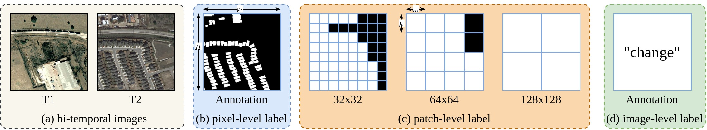
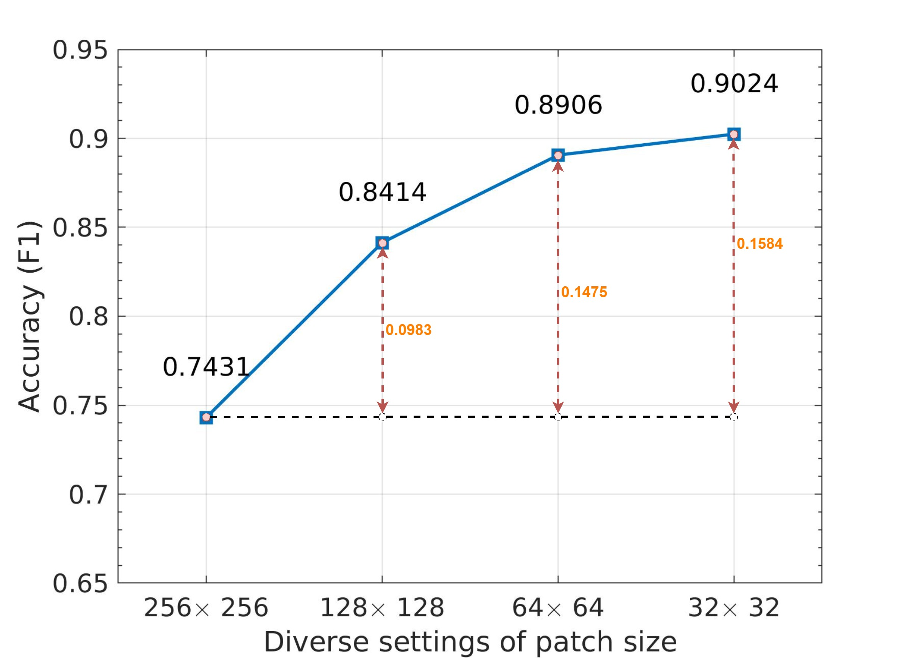
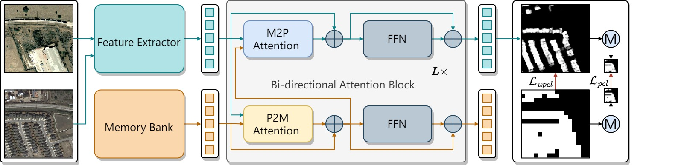

# <p align=center>`MS-Former: Memory-Supported Transformer for Weakly Supervised Change Detection with Patch-Level Annotations （under review）`</p>

This repository contains a Python implementation of our paper [MS-Former](https://arxiv.org/pdf/2311.09726.pdf).

### . Usage
+ Prepare the data:
    - Download datasets [LEVIR](https://justchenhao.github.io/LEVIR/), [BCDD-BGMix](https://github.com/tsingqguo/bgmix), [SYSU](https://github.com/liumency/SYSU-CD), and [GVLM](https://github.com/zxk688/GVLM)
    - Crop LEVIR datasets into 256x256 patches. Generate patch-level annotations for LEVIR, BCDD-BGMix, SYSU, and GVLM datasets. 
    - Generate list file as `ls -R ./label/* > test.txt`
    - The pre-processed datasets can be obtained from [BCDD-BGMix-PL](https://drive.google.com/file/d/1VrdQ-rxoGVM_8ecA-ObO0u-O8rSTpSHA/view?usp=sharing), [LEVIR-PL](https://drive.google.com/file/d/1VrdQ-rxoGVM_8ecA-ObO0u-O8rSTpSHA/view?usp=sharing), [SYSU-PL](https://drive.google.com/file/d/1VrdQ-rxoGVM_8ecA-ObO0u-O8rSTpSHA/view?usp=sharing), and [GLVM-PL](https://drive.google.com/file/d/1VrdQ-rxoGVM_8ecA-ObO0u-O8rSTpSHA/view?usp=sharing).
    - Prepare datasets into the following structure and set their path in `train.py` and `test.py`
    ```
    ├─Train
        ├─A        ...jpg/png
        ├─B        ...jpg/png
        ├─label    ...jpg/png
        ├─label_256    ...jpg/png
        ...
        ├─label_32    ...jpg/png
        └─list     ...txt
    ├─Test
        ├─A
        ├─B
        ├─label
        └─list
    ```

+ Prerequisites for Python:
    - Creating a virtual environment in the terminal: `conda create -n MS-Former python=3.8`
    - Installing necessary packages: `pip install -r requirements.txt`

+ Train/Test
    - `sh train.sh`
    - `sh test.sh`


### 2. Motivation
<figure>
  <p align="center">
    
  </p>
  <figcaption>Fig. 1 Comparison of the pixel-level, image-level, and our patch-level labels for remote sensing change detection.</figcaption>
</figure>
<br>
<figure>
  <p align="center">
    
  </p>
  <figcaption>Fig. 2 Comparison of the change detection performance measured by F1 of our proposed MS-Former using patch-level labels across different patch size settings on the BCDD dataset.</figcaption>
</figure>
<br>
Notably, as the patch size increases, the patch-level labels align more closely with image-level annotations, while decreasing patch size results in labels close to pixel-wise annotations. In this work, we observe that a slight reduction in patch size substantially enhances change detection performance. This observation suggests the potential of exploring patch-level annotations for remote sensing change detection.
<br>

### 3. Pipeline of the MS-Former
<figure>
  <p align="center">
    
  </p>
  <figcaption>Fig. 3 A framework of the proposed MS-Former.</figcaption>
</figure>
<br>
Initially, the bi-temporal images pass through a feature extractor to capture the temporal difference features. After that, the temporal difference features and prototypes stored in the memory bank are jointly learned by a series of bi-directional attention blocks. Finally, a patch-level supervision scheme is introduced to guide the network learning from the patch-level annotations. <br>

### 4. Citation

Please cite our paper if you find the work useful:

    @article{li2023ms,
        title={MS-Former: Memory-Supported Transformer for Weakly Supervised Change Detection with Patch-Level Annotations},
        author={Li, Zhenglai and Tang, Chang and Liu, Xinwang and Li, Changdong and Li, Xianju and Zhang, Wei},
        journal={arXiv preprint arXiv:2311.09726},
        year={2023}
    }
